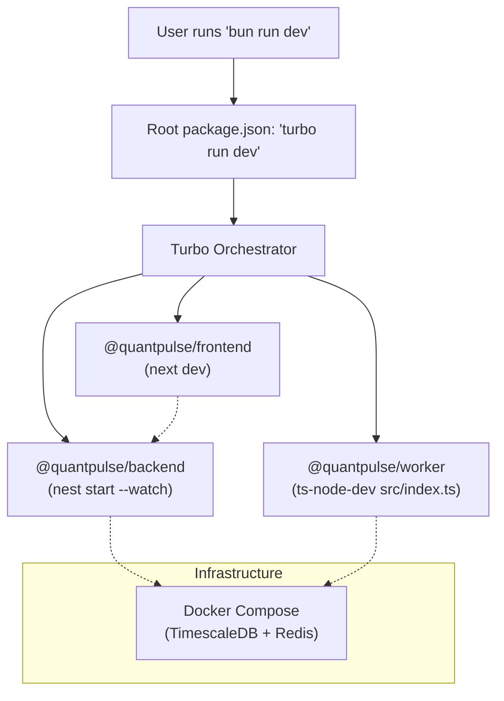

# QuantPulse — How It Works

## When you run `bun run dev`



## Complete Data Lifecycle (Step by Step)

### Step 1: Infrastructure Starts
Docker Compose runs **TimescaleDB** (port 5432) and **Redis** (port 6379).

### Step 2: Worker Boots (LIVE MODE)
The worker (`apps/worker`) does the following:
1. Connects to TimescaleDB via Prisma
2. Loads all commodity definitions (`assetId → UUID` mapping)
3. Starts **3 real connectors**:

| Connector | API Source | Polling Rate | What It Fetches |
|---|---|---|---|
| `ForexConnector` | ExchangeRate-API | Every 30 min | Real USD/INR rate → saves to `forex_rates` table |
| `TwelveDataConnector` | Twelve Data API | Every 60 sec | Gold, Silver, Crude Oil, Aluminium, Copper prices |
| `AlphaVantageConnector` | Alpha Vantage API | Every 5 min | Steel and supplementary global data |

### Step 3: Data Flow
```
Real API → Connector → DataNormalizer → processTick()
                                            │
                                ┌───────────┴───────────┐
                                │                       │
                          Redis Pub/Sub            Tick Buffer
                          (market:ticks)           (batched every 15s)
                                │                       │
                                ▼                       ▼
                          NestJS Backend         TimescaleDB
                          (PriceFeedGateway)     (price_history table)
                                │
                                ▼
                          Socket.io emit
                          (to subscribed clients)
                                │
                                ▼
                          Next.js Frontend
                          (Zustand store → React components)
```

### Step 4: Backend Serves (port 4000)
The NestJS backend provides:
- **REST API** — Fetches data FROM the database
- **WebSocket Gateway** — Listens to Redis and pushes data TO the frontend

### Step 5: Frontend Renders (port 3000)
The Next.js frontend:
1. Calls REST APIs on load (commodities, solar, news, forex)
2. Connects to WebSocket for live tick updates
3. Zustand store merges REST + WebSocket data
4. TradingView chart renders OHLC candles in real time

## API Keys Used
| Key | Service | Purpose |
|---|---|---|
| `TWELVE_API_KEY` | Twelve Data | Real-time MCX commodity prices |
| `ALPHA_VANTAGE_API_KEY` | Alpha Vantage | Supplementary global market data |
| `USD_INR_API_KEY` | ExchangeRate-API | Live USD/INR conversion rate |
| `BROKER_API_KEY` | Angel One | Reserved for future broker WebSocket |
