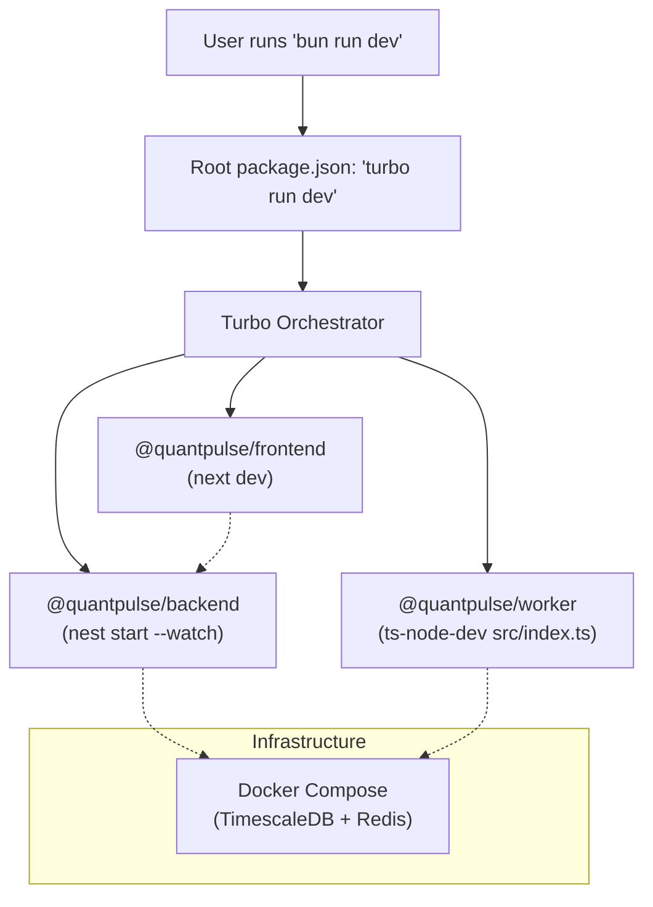

# QuantPulse — How It Works

## When you run `bun run dev`



## 🏛️ "Gold Standard" Architecture

| Data Source | Provider | Frequency | Method | Storage |
|---|---|---|---|---|
| Indian MCX (Gold/Silver) | Angel One | Real-time (Ticks) | WebSocket | Redis (Latest) + TimescaleDB (1m bars) |
| Global Spot (XAU/USD) | Twelve Data | Every 5 Minutes | REST API | TimescaleDB |
| Forex (USD/INR) | Twelve Data | Every 30 Minutes | REST API | Redis (Global Variable) |
| Market News | NewsData.io | Every 2 Hours | REST API | Postgres |

## Complete Data Lifecycle (Step by Step)

### Step 1: Infrastructure Starts
Docker Compose runs **TimescaleDB** (port 5432) and **Redis** (port 6379).

### Step 2: Worker Boots
The worker (`apps/worker`) does the following:
1. Connects to TimescaleDB via Prisma
2. Loads all commodity definitions (`assetId → UUID` mapping)
3. Starts **5 connectors**:

| # | Connector | API Source | Frequency | What It Fetches |
|---|---|---|---|---|
| 1 | `ForexConnector` | Twelve Data | 30 min | USD/INR rate → Redis global var + DB |
| 2 | `TwelveDataConnector` | Twelve Data | 5 min | Gold, Silver, Crude, Aluminium, Copper (global spot) |
| 3 | `AlphaVantageConnector` | Alpha Vantage | 5 min | Steel & supplementary data |
| 4 | `NewsDataConnector` | NewsData.io | 2 hours | Commodity news → sentiment → Postgres |
| 5 | `AngelOneConnector` | Angel One SmartAPI | Real-time | MCX futures via WebSocket (REST fallback) |

### Step 3: Data Flow
```
┌─────────────────────────────────────────────────────┐
│                   DATA SOURCES                       │
│                                                     │
│  Angel One WS ──┐                                   │
│  Twelve Data  ───┤── processTick() ──┬─ Redis Pub/Sub ── NestJS Gateway ── Socket.io ── Frontend
│  AlphaVantage ───┤                   │
│                  │                   ├─ Redis Latest  (tick:{assetId})
│                  │                   │
│  Twelve Data  ───┤── ForexConnector  ├─ Redis Global  (forex:USD_INR)
│                  │                   │
│  NewsData.io  ───┘── NewsConnector   └─ TimescaleDB   (price_history + commodity_news)
└─────────────────────────────────────────────────────┘
```

### Step 4: Backend Serves (port 4000)
The NestJS backend provides:
- **REST API** — Fetches data FROM the database
- **WebSocket Gateway** — Listens to Redis and pushes data TO the frontend

### Step 5: Frontend Renders (port 3000)
The Next.js frontend:
1. Calls REST APIs on load (commodities, solar, news, forex)
2. Connects to WebSocket for live tick updates
3. Zustand store merges REST + WebSocket data
4. TradingView chart renders OHLC candles in real time

## API Keys Used
| Key | Service | Purpose |
|---|---|---|
| `TWELVE_API_KEY` | Twelve Data | Global spot prices + Forex (USD/INR) |
| `ALPHA_VANTAGE_API_KEY` | Alpha Vantage | Supplementary global market data |
| `NEWS_API_KEY` | NewsData.io | Commodity market news |
| `BROKER_API_KEY` | Angel One | MCX real-time data (WebSocket) |
| `ANGEL_CLIENT_ID` | Angel One | Trading account Client ID |
| `ANGEL_PASSWORD` | Angel One | Trading account PIN |
| `ANGEL_TOTP_SECRET` | Angel One | TOTP secret for auto-login |
